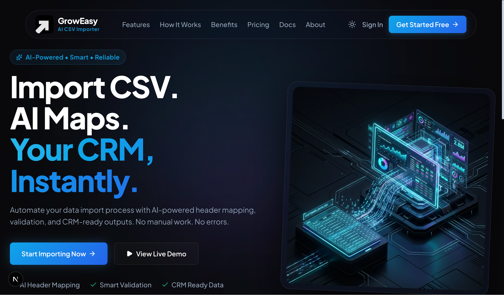
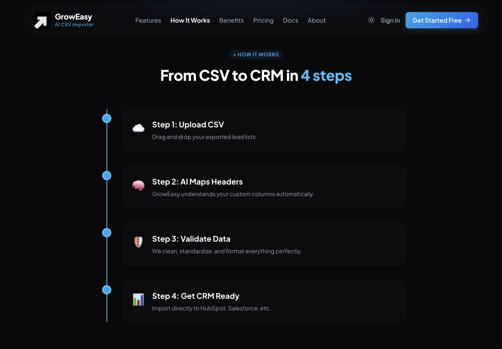
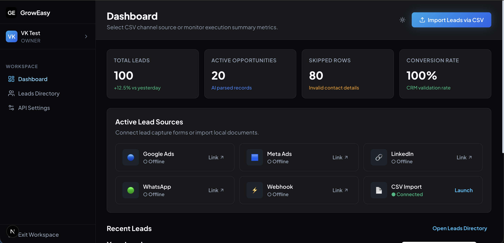
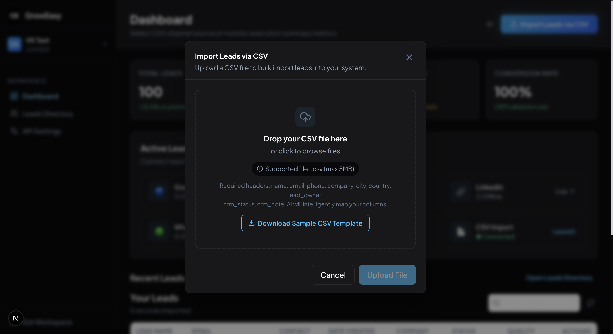
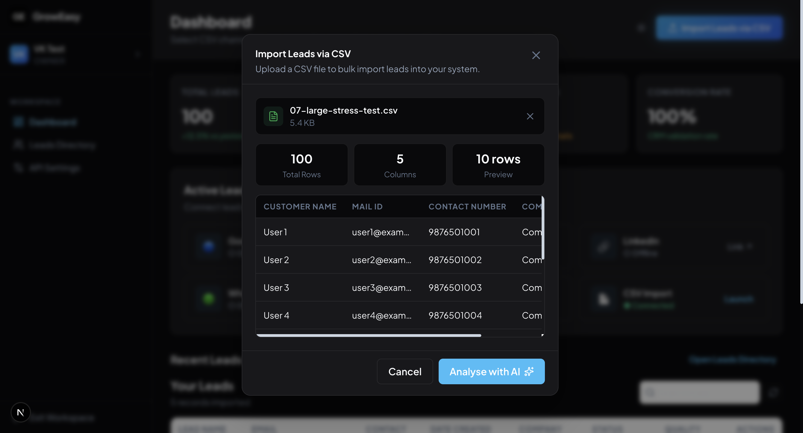
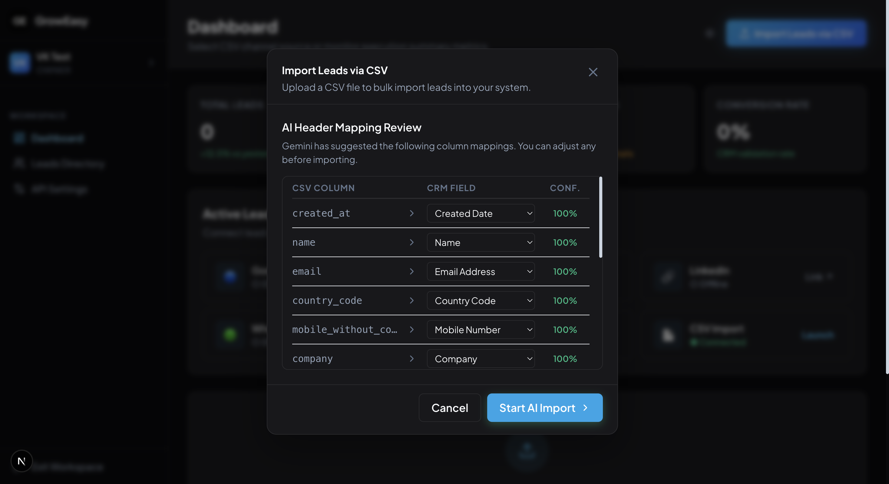
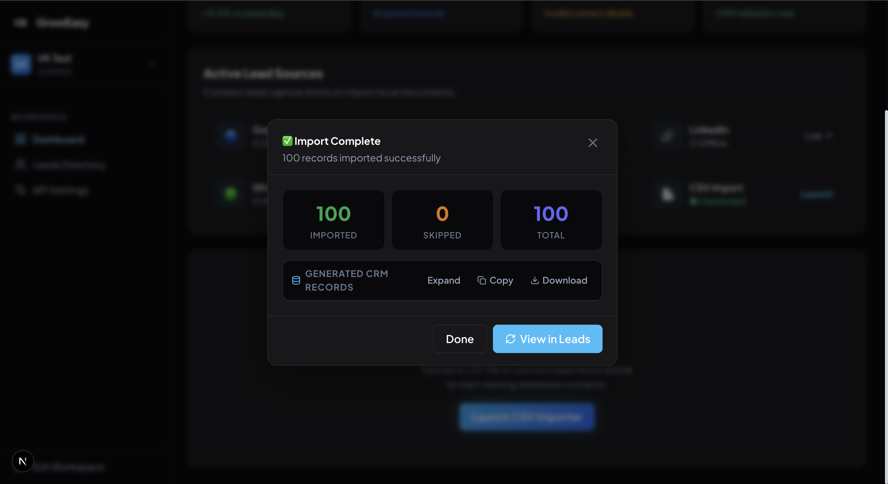
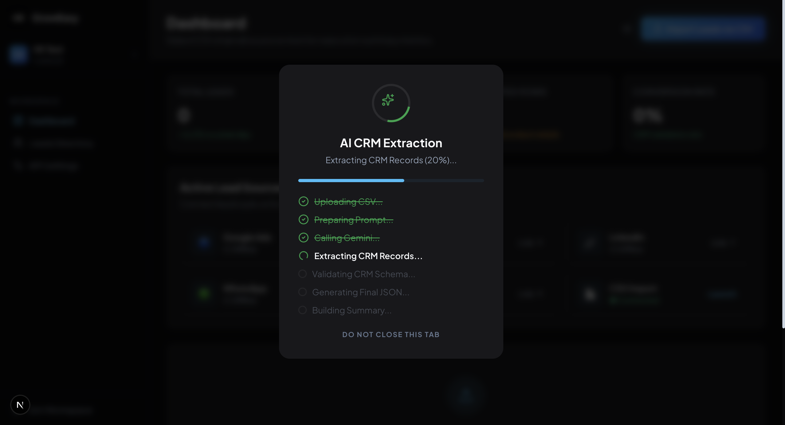
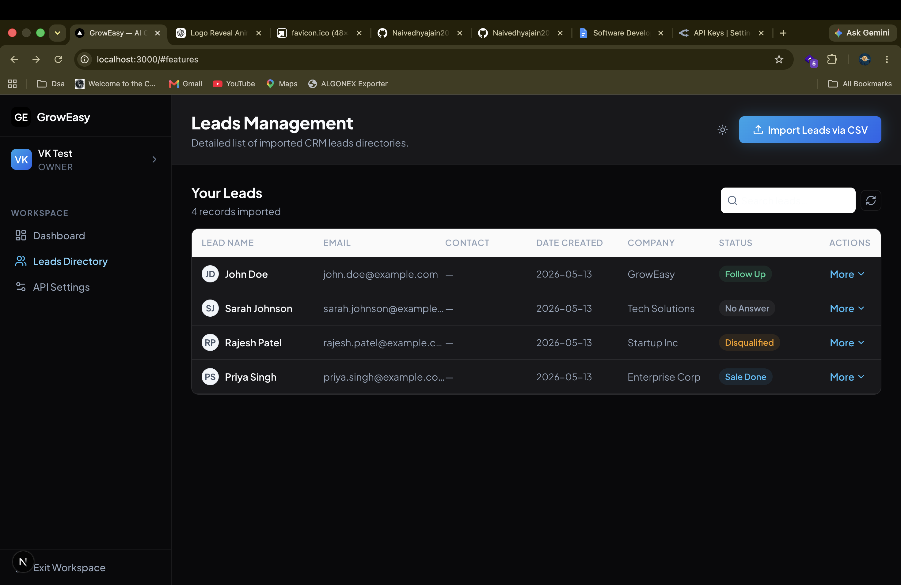

# 🚀 GrowEasy – AI Powered CSV Importer

> Import any CSV into a CRM using AI-powered Header Mapping, Schema Validation, Intelligent Data Transformation and CRM-ready JSON generation.


🌐 **Live Demo:** [https://ai-powered-csv-importer-gray.vercel.app/](https://ai-powered-csv-importer-gray.vercel.app/)

⚡ **Backend API:** [https://ai-powered-csv-importer-1b8i.onrender.com/](https://ai-powered-csv-importer-1b8i.onrender.com/)

📦 **GitHub:** [https://github.com/Naivedhyajain20/AI-powered-CSV-Importer](https://github.com/Naivedhyajain20/AI-powered-CSV-Importer)

---

# About

Businesses often receive CSV files exported from different CRMs, Google Sheets, Excel or third-party tools.

Every file contains different column names.

Manually mapping these columns before importing into a CRM is repetitive, error-prone and time consuming.

GrowEasy automates this entire workflow using AI.

---

# Features

| Feature | Description |
| --- | --- |
| **CSV Upload** | Drag & Drop CSV Upload |
| **Preview** | Preview rows before import |
| **AI Header Mapping** | Automatically maps CSV headers |
| **Validation** | Detects invalid mappings |
| **CRM Transformation** | Generates CRM Ready JSON |
| **Batch Processing** | Processes records in batches |
| **Retry Mechanism** | Retries failed AI requests |
| **Processing Summary** | Displays import analytics |
| **Lead Directory** | Shows imported CRM records |
| **Download JSON** | Export CRM-ready data |

---

# Project Preview

<details open>
<summary><b>Hero & Dashboard</b></summary>
<br>

### Landing Page


### Dashboard

</details>

<details>
<summary><b>📂 CSV Upload Workflow</b></summary>
<br>

### CSV Upload
Users upload a CSV file through drag-and-drop or file picker.

The backend validates:
✔ File Size  
✔ MIME Type  
✔ Empty Files  
✔ Invalid CSV  
before processing.



### CSV Preview
Displays a preview of the rows before import.



### AI Header Mapping
Automatically maps CSV headers to CRM fields using Gemini AI.



### AI Processing
Processes records in batches and transforms them into CRM-ready JSON.



### Import Summary
Displays import analytics, successful/failed rows, and allows exporting the final JSON.


</details>

<details>
<summary><b>Leads & Workflow</b></summary>
<br>

### Leads Directory
Shows imported CRM records and their statuses.



### Workflow Section
Visualizes the AI-powered import pipeline.


</details>

---

# Workflow

CSV Upload  
↓  
CSV Parsing  
↓  
Header Detection  
↓  
AI Header Mapping  
↓  
Schema Validation  
↓  
CRM Transformation  
↓  
Batch Processing  
↓  
Retry Failed Requests  
↓  
Generate CRM JSON  
↓  
Import Summary  
↓  
Lead Dashboard  

---

# Tech Stack

**Backend**
- Node.js
- Express
- TypeScript
- Gemini API

**Frontend**
- Next.js
- React
- TailwindCSS
- TypeScript

**Deployment**
- Vercel
- Render

---

# Folder Structure

```
├── backend/
│   └── src/
│       ├── config/
│       ├── controllers/
│       ├── middlewares/
│       ├── prompts/
│       ├── routes/
│       ├── services/
│       ├── types/
│       ├── utils/
│       └── validators/
└── frontend/
    └── src/
        ├── app/
        ├── components/
        ├── constants/
        ├── hooks/
        ├── services/
        └── types/
```

---

# API Endpoints

```
POST /api/v1/imports/upload

POST /api/v1/imports/mapping

POST /api/v1/imports/import

GET /api/v1/imports/status/:jobId
```

---

# AI Pipeline

CSV  
↓  
Normalize Headers  
↓  
Synonym Matching  
↓  
Confidence Score  
↓  
Gemini AI (Fallback)  
↓  
Validate Mapping  
↓  
CRM JSON  
↓  
Import Summary  

---

# Error Handling

✔ Invalid CSV  
✔ Empty CSV  
✔ Unsupported MIME  
✔ Invalid Mapping  
✔ AI Retry  
✔ Schema Validation  
✔ Duplicate Mapping Detection  
✔ Batch Failure Recovery  

---

# Local Setup

```bash
git clone https://github.com/Naivedhyajain20/AI-powered-CSV-Importer.git

npm install

cp .env.example .env

npm run dev
```

---

# Environment Variables

```env
PORT=
GEMINI_API_KEY=
```

---

# Future Improvements

- Authentication
- Multiple CRM Support
- Webhook Integration
- Background Queue
- CSV History
- Role Based Access
- Import Analytics
- Cloud Storage

---

# Author

**Naivedhya Jain**

- **Portfolio:** [https://naivedhyajain.engineer](https://naivedhyajain.engineer)
- **GitHub:** [https://github.com/Naivedhyajain20](https://github.com/Naivedhyajain20)
- **LinkedIn:** [NAIVEDHYA JAIN](https://www.linkedin.com/in/naivedhya-jain-64b791227/)

----

---
<div align="center">
  Made with ❤️ by <b>Naivedhya Jain</b>
</div>
