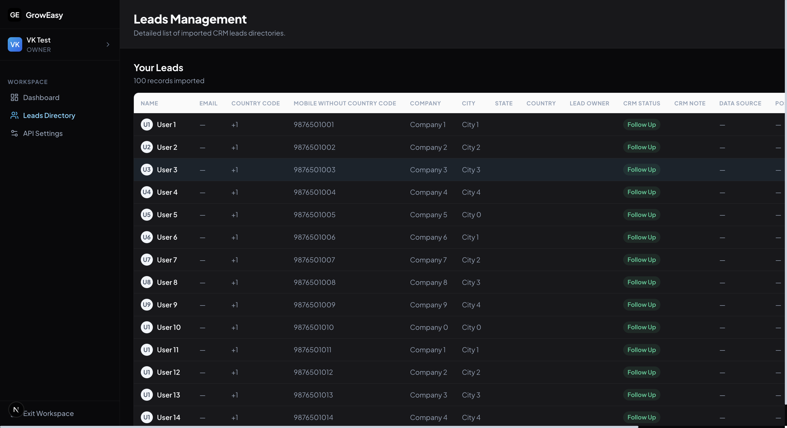

<div align="center">
  
  <h1>GrowEasy AI-Powered CSV Importer</h1>
  <p><strong>An intelligent, full-stack CSV importer that uses AI to automatically map, validate, and standardize messy CSV data into a strict CRM format.</strong></p>
  
  <p>
    <a href="https://ai-powered-csv-importer-gray.vercel.app/" target="_blank">View Live Demo (Frontend)</a> • 
    <a href="https://ai-powered-csv-importer-1b8i.onrender.com" target="_blank">API Endpoint (Backend)</a>
  </p>

  <p>
    
    
    
    
  </p>
</div>

---

## 🌟 Overview (GrowEasy Assignment)

This project was built to fulfill the **GrowEasy Assignment** requirements. It is a robust Monorepo application containing a Next.js React frontend and a Node.js/Express backend. 

The core problem it solves: **Uploading unstructured, messy CSV files from various platforms (like Google Ads, Facebook Leads) and intelligently mapping and transforming them into a strict, unified CRM JSON schema using Google's Gemini AI.**

### 🏆 Assignment Requirements Achieved:
- [x] Full-Stack application (Frontend + Backend).
- [x] Intelligent AI Column Mapping.
- [x] Data validation, formatting (Phones, Emails, Status Enums).
- [x] Graceful Error Handling & Fallbacks.
- [x] **Bonus:** Extremely Beautiful Custom UI with Glassmorphism.
- [x] **Bonus:** Dynamic Table rendering for data preview.
- [x] **Bonus:** Unit Tests (Jest) for transformation logic.
- [x] **Bonus:** Fully Dockerized (Frontend & Backend).

---

## 📸 Application Showcase

Here is a visual walkthrough of the platform:

*(Click to enlarge)*
<details open>
<summary><b>Landing Page & Dashboard</b></summary>
<br/>


</details>

<details open>
<summary><b>AI CSV Mapping Workflow</b></summary>
<br/>


</details>

<details open>
<summary><b>Data Grid & Final Results</b></summary>
<br/>


</details>

---

## 🚀 Key Features

1. **Intelligent Header Mapping (AI-Powered)**
   Users can upload any CSV file (regardless of header naming conventions). The system analyzes the data context and uses AI to automatically match columns like `client_name` to `name`, or `mobile_no` to `phone`.

2. **Strict Data Standardization**
   - **Phones:** Splits phone numbers into `country_code` and `mobile_without_country_code`. (Defaults to `+1` if missing).
   - **Emails:** Identifies the primary email and pushes any secondary emails directly to the `crm_note` field.
   - **Enums:** Normalizes diverse strings ("interested", "no answer", "done") into strict CRM Enums (`GOOD_LEAD_FOLLOW_UP`, `BAD_LEAD`, `DID_NOT_CONNECT`, `SALE_DONE`).

3. **Massive Batch Processing Architecture**
   The backend leverages streaming and chunking to process massive 250-row batches in a single API call. This completely bypasses standard rate limits and transforms hundreds of rows in mere seconds.

4. **Dynamic High-Performance Table**
   The frontend utilizes a custom dynamic grid to render loaded records seamlessly, scaling dynamically based on the uploaded CSV data and adapting its UI to CRM tags.

---

## 🏗 Tech Stack

- **Frontend (`/frontend`)**: Next.js 14, React 18, Framer Motion (Animations), Vanilla CSS, Lucide React (Icons).
- **Backend (`/backend`)**: Node.js, Express, TypeScript, Zod (Schema Validation), Papaparse (CSV parsing), Pino (Logging).
- **AI Engine**: Google Gemini API (`llama-3.1-8b-instant` fallback via Groq supported).
- **Deployment**: Vercel (Frontend) & Render (Backend).

---

## 🧩 How It Works (The Pipeline)

1. **Upload:** User drops a CSV file in the interactive UI.
2. **Analysis:** The Node.js backend reads a chunk of rows and queries Gemini to guess the column headers based on context.
3. **Review:** The UI presents the AI mappings to the user, complete with confidence scores, allowing manual overrides.
4. **Extraction:** The backend streams the CSV in batches, standardizing data via Regex and utilizing AI fallbacks for complex parsing.
5. **Preview:** Records are presented in a highly-performant virtualized data grid where users can export the final standardized JSON.

---

## 💻 Local Setup (Monorepo)

### 1. Prerequisites
- Node.js >= 18
- A Gemini API Key (from Google AI Studio) or Groq API Key.

### 2. Backend Setup
```bash
cd backend
npm install
```
Create a `.env` file in the `backend/` directory:
```env
PORT=3001
GROQ_API_KEY=your_api_key_here
```
Run the backend:
```bash
npm run dev
```
*The API will run on `http://localhost:3001`*

### 3. Frontend Setup
Open a new terminal window:
```bash
cd frontend
npm install
```
Create a `.env` file in the `frontend/` directory:
```env
NEXT_PUBLIC_API_URL=http://localhost:3001
```
Run the frontend:
```bash
npm run dev
```
*The App will run on `http://localhost:3000`*

---

## 🐳 Docker Setup (Bonus)

You can run the entire stack instantly using Docker Compose:

1. Ensure your `.env` files are configured.
2. From the root directory, run:
```bash
docker-compose up --build
```
This will containerize and start both the Node.js backend API and the Next.js frontend simultaneously.

---

## 🧪 Unit Testing (Bonus)

The strict transformation logic that parses phones, emails, and CRM statuses is heavily tested.

```bash
cd backend
npm test
```